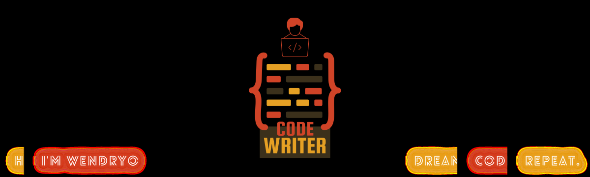

  
&nbsp;
&nbsp;
  
&nbsp;
  
&nbsp;
&nbsp;

  
&nbsp;
  
&nbsp;
    
&nbsp;
  
&nbsp;

  
  
  
  
  

  
  
  
  
  
  
  
  
&nbsp;

  
  
  
  
  
  
  
  
  
  
  
  
  
  

  
&nbsp;
  
&nbsp;
  
&nbsp;

Click for GitHub Stats

  
  

